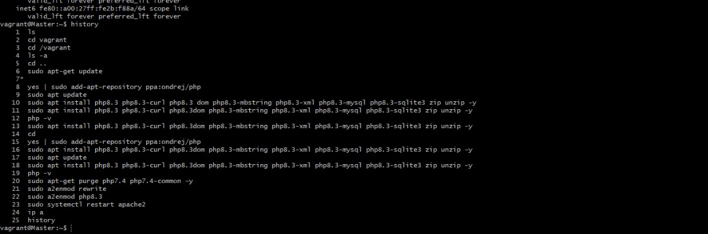
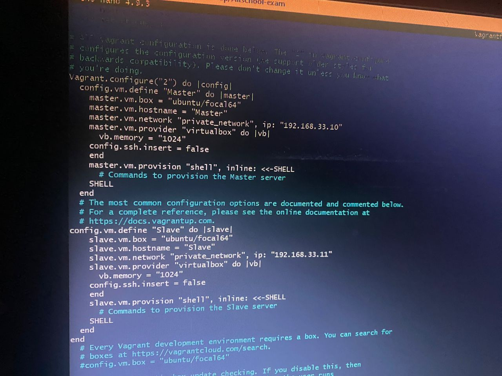
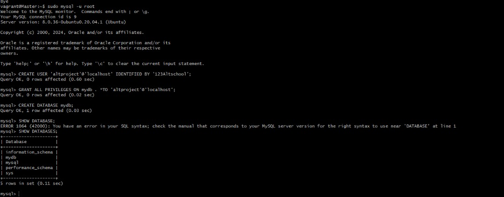
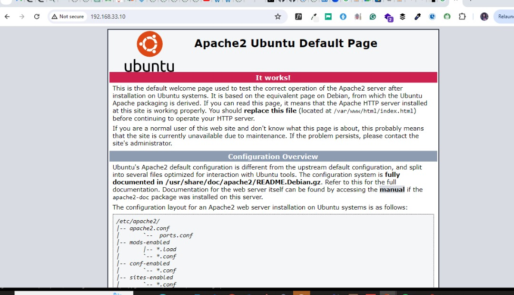
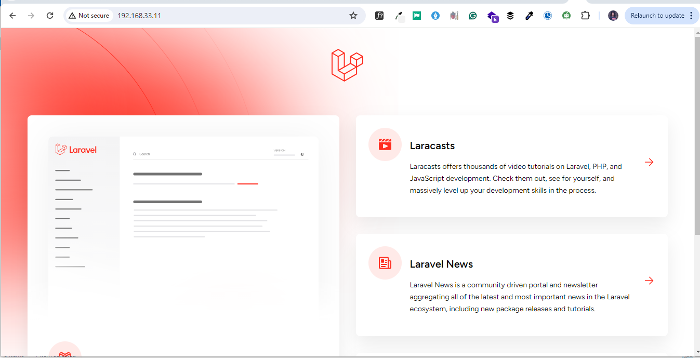

# Introduction

### Automate the provisioning of two Ubuntu-based servers, named “Master” and “Slave”, using Vagrant.

### On the Master node, create a bash script to automate the deployment of a LAMP (Linux, Apache, MySQL, PHP) stack.

### This script should clone a PHP application from GitHub, install all necessary packages, and configure Apache web server and MySQL. 

### Ensure the bash script is reusable and readable.
### Using an Ansible playbook:

